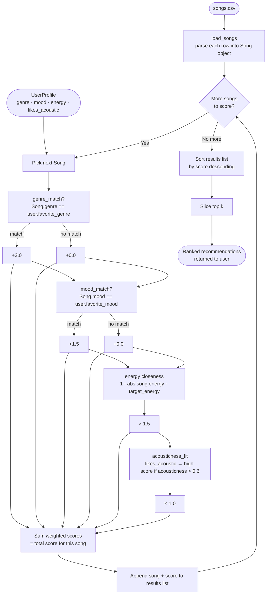

# Recommender Flowchart

```mermaid
flowchart TD
    A([songs.csv]) --> B[load_songs\nparse each row into Song object]
    B --> C{More songs\nto score?}

    UP([UserProfile\ngenre · mood · energy · likes_acoustic]) --> D

    C -- Yes --> D[Pick next Song]
    D --> E[genre_match?\nSong.genre == user.favorite_genre]
    E -- match --> E1[+2.0]
    E -- no match --> E2[+0.0]

    E1 & E2 --> F[mood_match?\nSong.mood == user.favorite_mood]
    F -- match --> F1[+1.5]
    F -- no match --> F2[+0.0]

    F1 & F2 --> G[energy closeness\n1 - abs song.energy - target_energy]
    G --> G1[× 1.5]

    G1 --> H[acousticness_fit\nlikes_acoustic → high score if acousticness > 0.6]
    H --> H1[× 1.0]

    E1 & E2 & F1 & F2 & G1 & H1 --> I[Sum weighted scores\n= total score for this song]
    I --> J[Append song + score to results list]
    J --> C

    C -- No more --> K[Sort results list\nby score descending]
    K --> L[Slice top k]
    L --> M([Ranked recommendations\nreturned to user])
```
